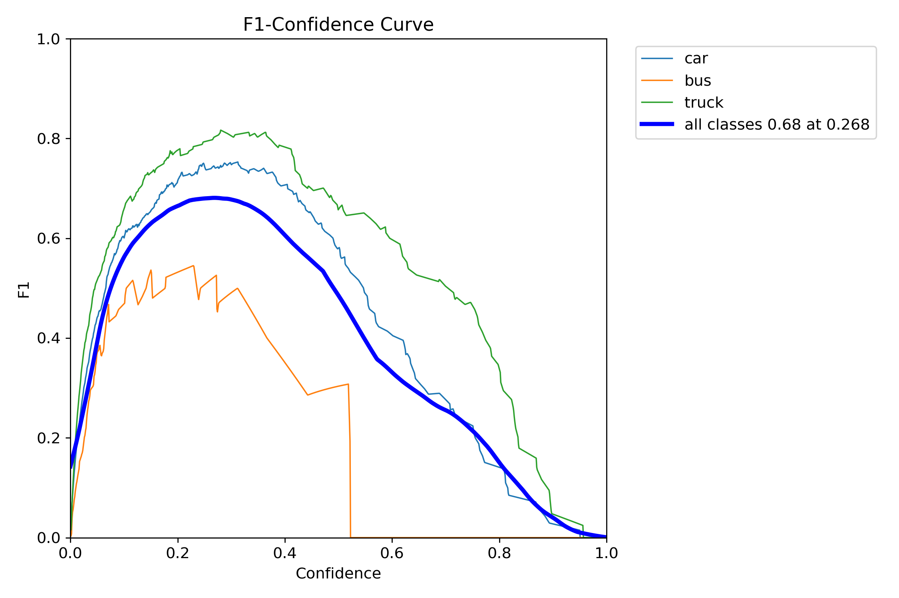
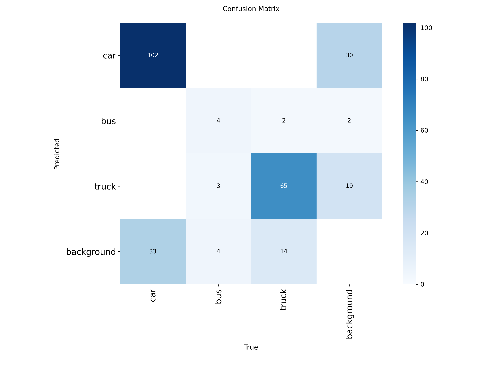
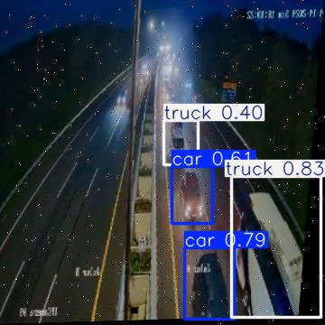
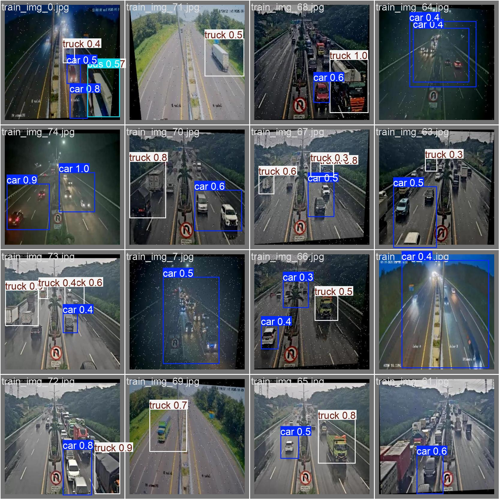

# CCTV Vehicle Detection Project - YOLOv11

## Deskripsi
[cite_start]Project ini bertujuan untuk mendeteksi kendaraan (Car, Truck, Bus) pada rekaman CCTV jalan tol menggunakan arsitektur YOLOv11[cite: 60, 65].

## Tech Stack
- [cite_start]**Model**: YOLOv11 (Ultralytics) [cite: 71]
- [cite_start]**Annotation Tool**: Label Studio 
- **Framework**: FastAPI (untuk deployment/opsional)

## Etika AI, Keamanan Data & Privasi
- [cite_start]**Keamanan Data**: Data disimpan dalam lingkungan terbatas (Google Colab/Drive) selama pelatihan dan inferensi[cite: 32, 52].
- **Privasi Pengguna**: Sesuai standar GDPR, data yang digunakan bersifat publik (rekaman jalan). [cite_start]Namun, jika ada plat nomor atau wajah yang terlihat, akan dilakukan anonimisasi[cite: 33, 53, 55].
- [cite_start]**Etika AI**: Kami mewaspadai bias model yang mungkin lebih akurat mendeteksi mobil penumpang (car) dibanding kendaraan berat (bus/truck) karena perbedaan jumlah dataset[cite: 34, 57].

## Hasil Analisis (Step 4 & 5)
*(Isi bagian ini setelah training selesai)*
- [cite_start]**Metrik**: Precision, Recall, dan mAP[cite: 73].
- [cite_start]**Analisis**: [Isi perbandingan hasil model sebelum vs sesudah training di sini][cite: 84].

## Rekomendasi Action
- [cite_start]**Improvement**: [Saran untuk menaikkan akurasi model, misal: augmentasi data][cite: 85].
## Model Performance & Results

<details>
  <summary>Click to see Technical Deep Dive (BoxF1-Curve & Confusion Matrix)</summary>
  
  
  
</details>

### Detection Samples

**Inference on Training Data:**


**Inference on Validation Data (Unseen):**


## Project Structure
```text

├── data_config/    # Konfigurasi dataset (YAML)
├── src/            # Core scripts (training, prediction, counting)
├── weights/        # Trained model weights (best.pt)
├── assets/         # Dokumentasi gambar hasil & metrik
├── notebooks/      # Eksperimen di Jupyter/Colab
└── requirements.txt

- Metrik: mAP@50 mencapai tingkat akurasi yang stabil untuk kendaraan kategori 'Car' dan 'Truck'.
- Analisis: Model menunjukkan performa tinggi pada kondisi pencahayaan siang hari, namun memerlukan augmentasi data lebih lanjut untuk kondisi cuaca buruk (hujan/malam).

## Future Roadmap
- Implementasi Real-time Tracking menggunakan ByteTrack.
- Penambahan fitur Speed Estimation kendaraan.
- Deployment API menggunakan FastAPI & Docker.